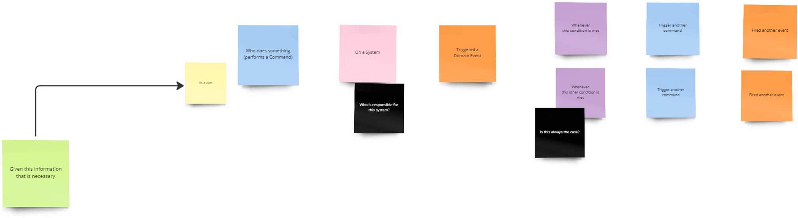
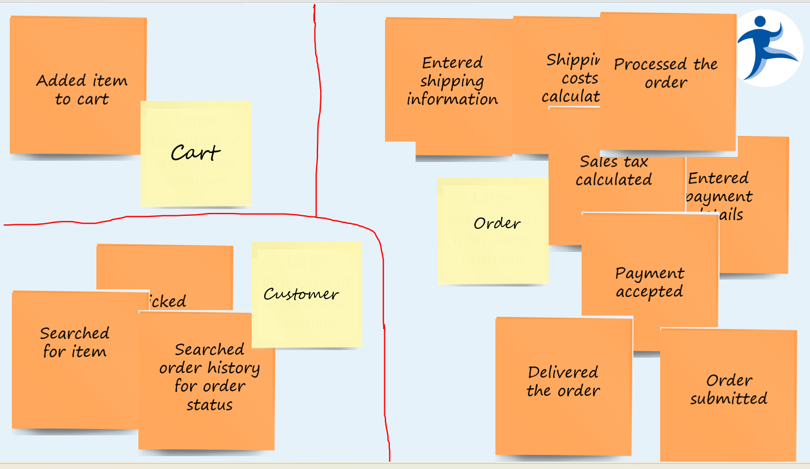
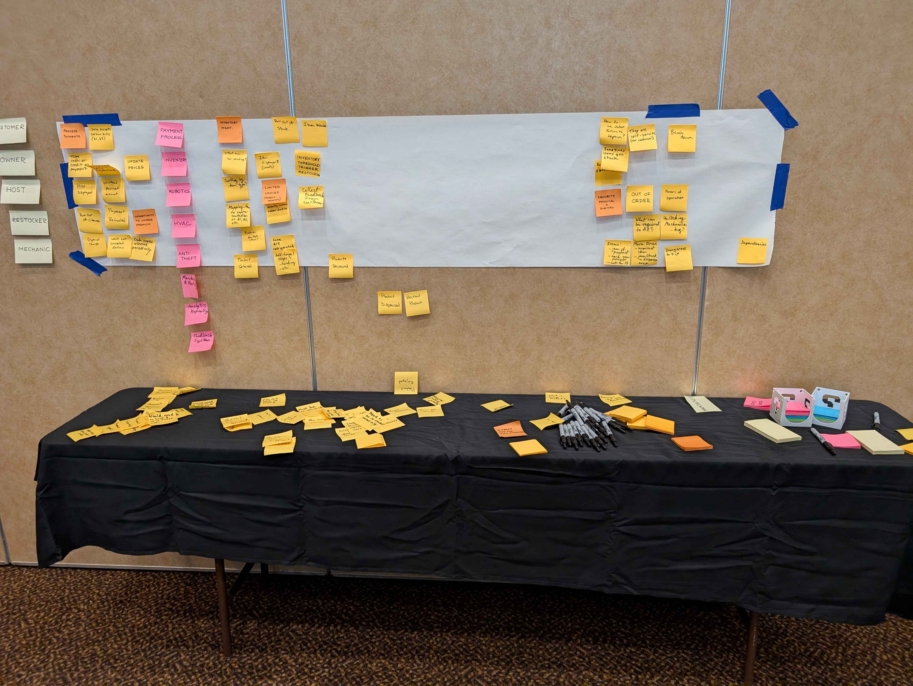
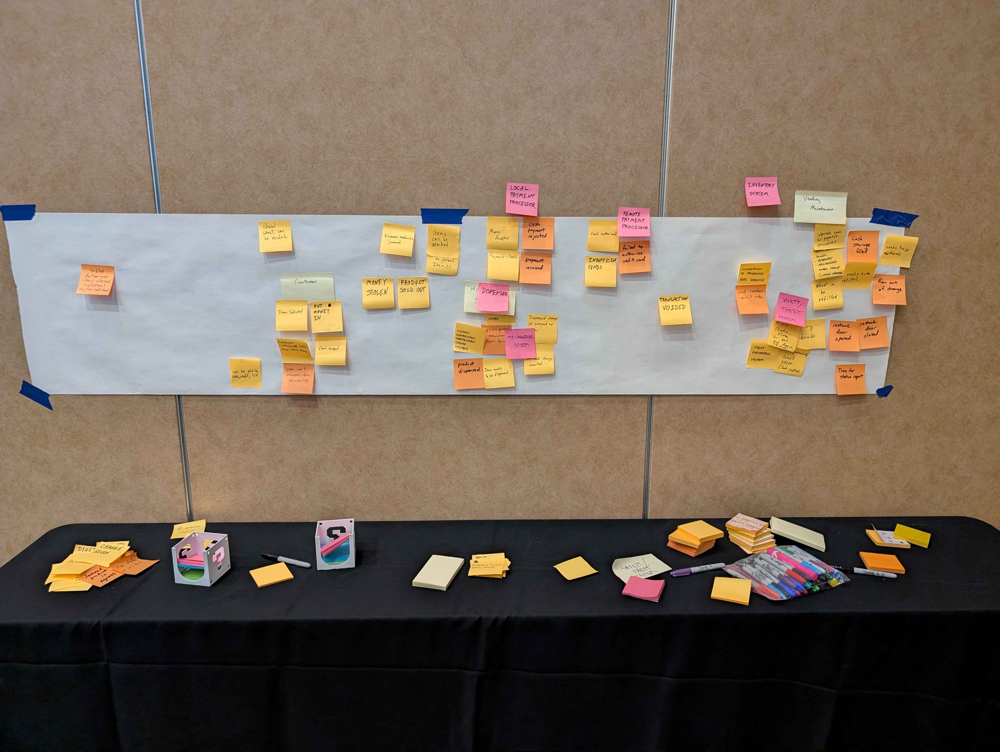
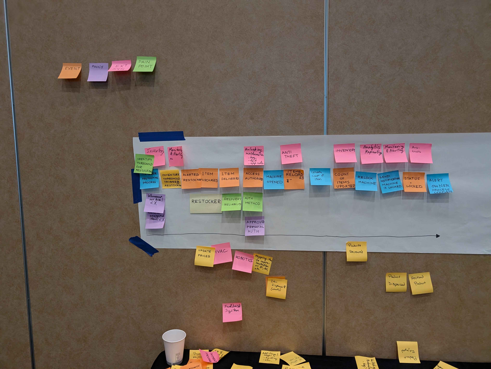
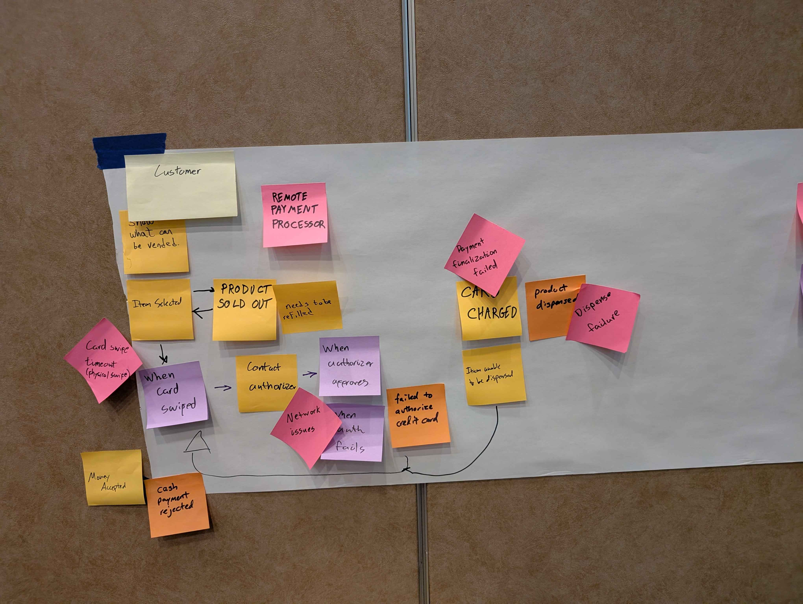

# Workshop Notes for "Snack Time: EventStorming with Snack-Inspired Systems"

While it wouldn't make sense to release the slides since there are a lot of slides without context, I didn't want to leave you hanging on notes from the workshop. So here we go!

- Sadukie

---

## Table of Contents

- [What is EventStorming?](#what-is-eventstorming)
- [EventStorming Grammar](#eventstorming-grammar)
- [What is an Event?](#what-is-an-event)
- [Why the Orange Sticky Note?](#why-the-orange-sticky-note)
- [Key Quote for EventStorming](#key-quote-for-eventstorming)
- [Types of EventStorming](#types-of-eventstorming)
- [Big Picture EventStorming](#big-picture-eventstorming)
- [EventStorming in Companies](#eventstorming-in-companies)
- [Big Picture EventStorming Process](#big-picture-eventstorming-process)
- [Sticky Notes in EventStorming](#sticky-notes-in-eventstorming)
- [Big Picture EventStorming Exercise](#big-picture-eventstorming-exercise)
- [How EventStorming Sessions can Flow](#how-eventstorming-sessions-can-flow)
- [Transitioning Between Big Picture and Process Modeling](#transitioning-between-big-picture-and-process-modeling)
- [EventStorming for Process Modeling](#eventstorming-for-process-modeling)
- [EventStorming for Process Modeling - The Process](#eventstorming-for-process-modeling---the-process)
- [Process Modeling EventStorming Exercise](#process-modeling-eventstorming-exercise)
- [EventStorming for System Design](#eventstorming-for-system-design)
- [EventStorming for Refactoring](#eventstorming-for-refactoring)
- [Resources](#resources)
- [Contact Info](#contact-info)

---

## What is EventStorming?

- A **collaborative, workshop-based experience** to gain a shared understanding of a _complex business system_
- While this is more common in **domain-driven design** (DDD), it is not limited to DDD. I will show you how you can use it to introduce DDD if you wish or continue operating in a non-DDD environment while exploring things with EventStorming.

## EventStorming Grammar

- **Conversations** with sticky notes
- Eventually the sticky notes are structured to follow a particular grammar
- We will look at the grammar in depth later.

## What is an Event?

- Orange sticky note
- Written in the past tense
- Answers the question of "What happened?"

## Why the Orange Sticky Note?

- Alberto Brandolini - father of EventStorming

## Key Quote for EventStorming

> Merge the people, split the software. - Alberto Brandolini

- Bring the people together to have the conversations and build the understanding.
- Have the conversations to better understand the business domain.
- With those conversations, split the software into manageable parts - possibly modules or bounded contexts.

## Types of EventStorming

- **Big Picture EventStorming**
  - Goal: Build a shared understanding
  - Used for discovery - understanding a business concept, a potential product, something in the business domain
- **Process Modeling EventStorming**
  - Goal: Address the Hot Spots (the pain points, the unknowns, the unanswered questions)
  - Used for exploring a process
  - Typically limited to a single end-to-end process
- **EventStorming for System Design**
  - Goal: Evaluate a system and propose a solution
  - Design a solution
  - Be aware of alternatives
  - **Hide unnecessary complexity from the users**
- **EventStorming for People Experience** (Sadukie-ism)
  - Goal: Understand the customer / user / persona interactions and experiences
  - Built on top of Process Modeling
  - For example, maybe a hospital site and the crisis persona (someone dealing with a medical emergency) - See also ["Designing for Crisis" by Eric Meyer](https://www.youtube.com/watch?v=qyZq6v3vZqo).
  - If you're a developer tools creator, you could use this to identify processes developers go through and how to make it easier for them to adopt your tools.
  - In addition to user experience, this can also be used to see where you can add value in a process.
- **EventStorming for Refactoring** (Also a Sadukie callout)
  - Goal: Identify what is available in a legacy system and potential refactor points.
  - This can be helpful especially when navigating conversations around legacy code, modular monoliths, and microservices.

## Big Picture EventStorming

> Nobody knows the whole story.

- Those who need to be in the room where it (EventStorming) happens:
  - Those with questions
  - Those with answers
  - A neutral facilitator who can keep things focused and moving along
- Typically no more than 10-15 people
- Make sure only relevant people and not everyone for the sake of meetings

## EventStorming in Companies

These are some challenges that can be seen when trying to facilitate EventStorming sessions in these environments.

- **Startups**
  - Fewer silos, if any
  - People wearing multiple hats
  - People who are more likely to admit they don't know something (very few office politics)
  - May find company gaps where no one knows
  - May be easier to schedule people
- **Corporate**
  - Get a consultant or outside facilitator who isn't tied to office politics
  - Silos make it harder to get answers
  - Silos make it harder to identify the right people to talk with
  - It may be harder to identify the key people to help address the situation.

## Big Picture EventStorming Process

1. Chaotic Exploration
  - Commonly started with a quiet "think alone" period before getting sticky notes out.
  - Encourage people to worry about their own ideas and questions, rather than seeking out what might already be posted.
  - Deduplication is handled in the next step, though if groups start identifying duplicates and grouping them organically, that's fine.
2. Deduplication
  - Group together the sticky notes that represent the same idea.
3. People and Systems
  - Identify people and systems that may be a part of what you're exploring. If you have the ability to identify these things, you may find more people with questions and more people with answers.
  - For example, we had an eCommerce site with some calculation issues. In the process, we thought it was an ERP system gone wrong. In reality, the ERP system depended on a tax system that was having issues. Through conversations, we discovered a new-to-us system (the tax system) and were able to identify the admin of the system.
4. Identify Areas to Explore
  - Usually EventStorming sessions are not exhaustive. They are the start of the conversations. You may discover more topics that need deeper exploring and more time to understand them.
  - You may also discover some misunderstandings and have to have more conversations to have a solid shared understanding.

## Sticky Notes in EventStorming

Sticky notes help with triggering the conversations during EventStorming. We use different colors to represent different parts of our conversations.

### The Colors

- Orange - Events
  - Written in past tense
  - Answer "What happened?"
  - Example: Signed up for the workshop
- Light Blue - Commands
  - Written in imperative form - "Do Something"
  - Can trigger events
  - Can be performed by users or even by external systems
  - Example: Sign up for the workshop.
- Little Yellow - Users / Roles / Personas
  - Sometimes includes iconography like stick figures
  - Can be generic or specific depending on the situation
  - Examples: attendee, user, {{YOUR_NAME}}
- Light Purple or Lilac - Policies
  -"Under what conditions?"
  - "Whenever..."
  - "Until..."
  - "Unless..."
  - Example: Whenever the seats are full
- Light Pink - External Systems
  - External to the system you are exploring
  - May be a 3rd party system
  - May be an internal system
  - Examples in eCommerce: tax system, fraud system, inventory system, payment system
- Red or Purple - Hot Spots / Issues / Problems
  - What are the pain points?
  - What are the unknowns?
  - **If the red is too close to the light pink for systems, use a color that will stand out compared to the other sticky notes that are used.**
  - Seen in slides as comment bubbles or black sticky notes
- Yellow - Aggregates
  - Used for grouping related objects for the purpose of data changes
  - Commonly used in building or refactoring systems
  - Not necessarily used in Big Picture or Process Modeling EventStorming
- Light Green - Read Models
  - Data needed to make a decision 

### The Grammar

1. Given some needed information (light green sticky notes - read models)
2. As a user (little yellow sticky notes - users/personas/roles)
3. Do something (light blue sticky notes - commands)
4. That involves an external system (pink sticky note - external system)
5. Something happened (orange sticky notes - events)
6. Ask a question about the external system from step 4 (purple or red sticky notes or some other color that stands out - hot spots, unknowns, questions, pain points)
7. Under a condition or "whenever" (light purple or lilac sticky note - policies)
8. Do something else (see step 3)
9. Something else got done (see step 5)
...

In System Design or Refactoring, you may have a bunch of events (orange sticky notes) that are related to a concept. It may make sense to group them with an aggregate (yellow sticky note).

---

## Big Picture EventStorming Exercise

Get into groups and talk about the theme - vending machines!

Some vending machines were shown to help get people thinking:

- A row of beverage vending machines
- A pizza vending machine that not only vends a pizza but it cooks it as part of the vending process
- A car vending machine! (Carvana)
- Also mentioned the Sprinkles Cupcakes ATMs in Vegas that will take a cupcake, box it, and vend it!

These happened:

---

## How EventStorming Sessions can Flow

Note that these are suggested paths of common experiences of EventStorming. However, there are no prerequisites that you must have one session before having another. While helpful, it is not mandatory.

- Big Picture -> Process Modeling -> People Experience
- Big Picture -> System Design
- Big Picture -> Refactoring

## Transitioning Between Big Picture and Process Modeling

- Processes typically discovered in conversations during Big Picture EventStorming
- Deep dive into these processes with Process Modeling EventStorming

## EventStorming for Process Modeling

- Collaborative process modeling
- Limited scope - typically to a single end-to-end process
- Smaller number of people
- Goals:
  - All process paths are completed
  - All hot spots or pain points are addressed
  - All stakeholders are reasonably happy
  - The color grammar is preserved with no holes or gaps

## EventStorming for Process Modeling - The Process

1. Chaotic exploration
2. Deduplication + Timeline
  - While deduplicating, order events chronologically.
3. People and Systems
4. Identify Possible Pain Points & Possible Resolutions

---

## Process Modeling EventStorming Exercise

Get into groups and identify a process to explore based on conversations in Big Picture.

One group got into restocking a vending machine.

Another group explored payment processing.

---

## EventStorming for System Design

- Used to help implement system features that solve a specific problem
- Designing a solution
- In the end, agree on a solution
- Make alternatives visible
- Bigger egos – systems designers, software architects, senior devs
- Hide unnecessary complexity

## EventStorming for Refactoring

We showed in this how we identified events happening in our eCommerce checkout process. We grouped events with these aggregates:

- Aggregate: Cart
  - Added item to cart
- Aggregate: Customer
  - Searched for item
  - Searched order history for order status
- Aggregate: Order
  - Entered shipping information
  - Processed the order
  - Payment accepted
  - Delivered the order
  - Order submitted
  - Sales tax calculated

## Resources

See [Resources in the README](./README.md)

## Contact Info

- [LinkedIn](https://linkedin.com/in/sadukie)
- [Email](mailto:sarah.dutkiewicz@nimblepros.com)
- [Have NimblePros help you!](https://bit.ly/contact-np)